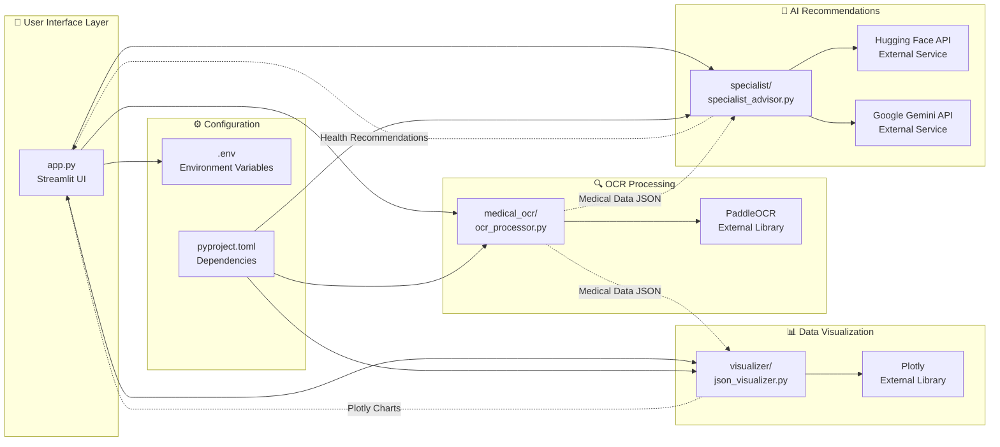
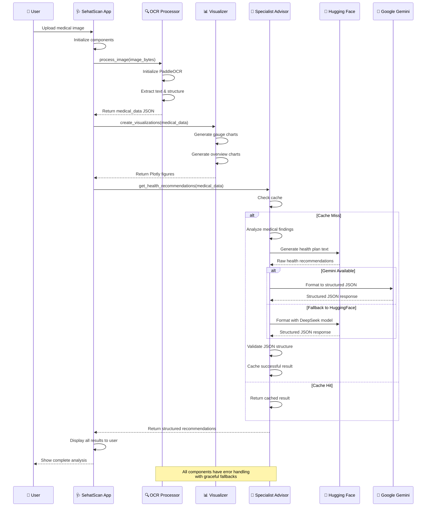
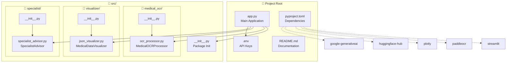

# 🏗️ SehatScan Architecture

## System Flow Diagram

```mermaid
flowchart TD
    %% User Input Layer
    User[👤 User] --> Upload[📤 Upload Medical Image]
    User --> JsonInput[📝 Input JSON Data]
    
    %% Main Application Entry Point
    Upload --> App[🩺 app.py<br/>SehatScanApp.main]
    JsonInput --> App
    
    %% Configuration & Setup
    App --> Config[⚙️ configure_page<br/>Set page config & CSS]
    Config --> Sidebar[📋 render_sidebar<br/>API key inputs]
    
    %% Input Processing Branch
    Sidebar --> TabCheck{Input Type?}
    
    %% Image Processing Path
    TabCheck -->|Image Upload| FileUpload[📄 render_file_upload<br/>Handle image upload]
    FileUpload --> ProcessBtn{Process Button<br/>Clicked?}
    ProcessBtn -->|Yes| InitOCR[🔧 initialize_ocr<br/>Lazy load OCR processor]
    
    %% OCR Processing Chain
    InitOCR --> OCRProcessor[🔍 src/medical_ocr/<br/>MedicalOCRProcessor.__init__]
    OCRProcessor --> PaddleOCR[🤖 PaddleOCR<br/>Initialize OCR engine]
    PaddleOCR --> ProcessImage[📊 process_image<br/>Main OCR processing]
    
    %% OCR Internal Flow
    ProcessImage --> OCRMethod{OCR Method}
    OCRMethod -->|Primary| GeminiOCR[🚀 ocr.ocr<br/>Gemini-1.5-flash method]
    OCRMethod -->|Fallback| PredictOCR[🔄 ocr.predict<br/>Traditional method]
    
    GeminiOCR --> ConvertFormat[🔄 _convert_ocr_result_to_legacy_format]
    PredictOCR --> ExtractDetections[📋 _extract_detections<br/>Parse OCR results]
    ConvertFormat --> ExtractDetections
    
    ExtractDetections --> GroupLines[📏 _group_lines<br/>Group text by Y-coordinate]
    GroupLines --> ParseReport[📝 _parse_medical_report<br/>Extract structured data]
    
    %% JSON Input Path
    TabCheck -->|JSON Input| JsonValidation[✅ JSON Validation<br/>Parse & validate JSON]
    JsonValidation --> MedicalData[📊 Medical Data Object]
    ParseReport --> MedicalData
    
    %% Data Processing & Display
    MedicalData --> DisplayData[📋 display_extracted_data<br/>Show patient info & results]
    DisplayData --> CreateViz[📈 create_visualizations<br/>Generate charts]
    
    %% Visualization Chain
    CreateViz --> VizProcessor[🎨 src/visualizer/<br/>MedicalDataVisualizer]
    VizProcessor --> CreateCharts[📊 create_visualizations<br/>Main viz method]
    CreateCharts --> GaugeCharts[⭕ _create_gauge_chart<br/>Individual test gauges]
    CreateCharts --> OverviewCharts[📈 _create_overview_charts<br/>Summary charts]
    
    GaugeCharts --> PlotlyGauge[📊 Plotly Gauge Charts<br/>Color-coded results]
    OverviewCharts --> PlotlyBar[📊 Plotly Bar/Pie Charts<br/>Overview visualizations]
    
    %% AI Recommendations Flow
    MedicalData --> GenRec{Generate<br/>Recommendations?}
    GenRec -->|Yes| CheckAPI{API Key<br/>Available?}
    CheckAPI -->|No| APIWarning[⚠️ Show API key warning]
    CheckAPI -->|Yes| InitSpecialist[🤖 initialize_specialist_advisor<br/>Setup AI advisor]
    
    %% Specialist Advisor Chain
    InitSpecialist --> SpecialistAdvisor[🧠 src/specialist/<br/>SpecialistAdvisor.__init__]
    SpecialistAdvisor --> ClientSetup[🔧 Setup AI Clients<br/>HuggingFace + Gemini]
    ClientSetup --> CacheCheck{Cache<br/>Available?}
    
    CacheCheck -->|Hit| ReturnCached[⚡ Return cached results]
    CacheCheck -->|Miss| GetHealthPlan[🩺 _get_health_plan_optimized<br/>Generate recommendations]
    
    %% AI Processing Chain
    GetHealthPlan --> AnalyzeFindings[🔍 _quick_analyze_findings<br/>Extract key health issues]
    AnalyzeFindings --> MedicalAI[🧠 Hugging Face AI<br/>Intelligent-Internet/II-Medical-8B]
    
    MedicalAI --> HealthPlanText[📝 Raw Health Plan Text<br/>Diet & exercise recommendations]
    HealthPlanText --> FormatChoice{Formatting<br/>Method?}
    
    %% JSON Formatting Options
    FormatChoice -->|Gemini Available| GeminiFormat[🚀 _format_with_gemini_or_fallback<br/>Google Gemini-1.5-flash]
    FormatChoice -->|Fallback| HFFormat[🔄 _format_with_huggingface<br/>DeepSeek-V3.2-Exp]
    
    GeminiFormat --> ValidateJSON[✅ _validate_json_structure<br/>Check required fields]
    HFFormat --> ValidateJSON
    
    ValidateJSON -->|Valid| CacheResult[💾 Cache successful result]
    ValidateJSON -->|Invalid| FallbackFormat[🔄 Try alternative format]
    FallbackFormat --> HFFormat
    
    %% Final Output
    CacheResult --> StructuredRec[📋 Structured Recommendations<br/>Diet + Exercise + Disclaimer]
    ReturnCached --> StructuredRec
    
    %% Display Results
    StructuredRec --> DisplayRec[📋 Display Recommendations<br/>Format for user display]
    PlotlyGauge --> FinalDisplay[🖥️ Final User Interface<br/>Complete analysis results]
    PlotlyBar --> FinalDisplay
    DisplayRec --> FinalDisplay
    
    %% Error Handling
    ProcessImage -.->|Error| OCRError[❌ OCR Processing Error]
    MedicalAI -.->|Error| AIError[❌ AI Generation Error]
    GeminiFormat -.->|Error| FormatError[❌ JSON Format Error]
    
    OCRError --> ErrorDisplay[⚠️ Show error message]
    AIError --> ErrorDisplay
    FormatError --> ErrorDisplay
    
    %% External Services
    MedicalAI -.-> HuggingFace[🤗 Hugging Face API<br/>Medical Analysis]
    GeminiFormat -.-> GoogleAI[🔮 Google Gemini API<br/>JSON Formatting]
    HFFormat -.-> HuggingFace2[🤗 Hugging Face API<br/>DeepSeek Model]
    
    %% Styling
    classDef userInput fill:#e1f5fe
    classDef mainApp fill:#f3e5f5
    classDef ocrProcess fill:#e8f5e8
    classDef aiProcess fill:#fff3e0
    classDef visualization fill:#fce4ec
    classDef external fill:#f1f8e9
    classDef error fill:#ffebee
    
    class User,Upload,JsonInput userInput
    class App,Config,Sidebar,TabCheck mainApp
    class OCRProcessor,ProcessImage,ExtractDetections,GroupLines,ParseReport ocrProcess
    class SpecialistAdvisor,MedicalAI,GeminiFormat,HFFormat aiProcess
    class VizProcessor,CreateCharts,GaugeCharts,OverviewCharts visualization
    class HuggingFace,GoogleAI,HuggingFace2 external
    class OCRError,AIError,FormatError,ErrorDisplay error
```

## Component Interaction Matrix

```mermaid
graph LR
    subgraph "🎯 User Interface Layer"
        UI[app.py<br/>Streamlit UI]
    end
    
    subgraph "🔍 OCR Processing"
        OCR[medical_ocr/<br/>ocr_processor.py]
        PADDLE[PaddleOCR<br/>External Library]
    end
    
    subgraph "📊 Data Visualization"
        VIZ[visualizer/<br/>json_visualizer.py]
        PLOTLY[Plotly<br/>External Library]
    end
    
    subgraph "🧠 AI Recommendations"
        SPEC[specialist/<br/>specialist_advisor.py]
        HF[Hugging Face API<br/>External Service]
        GEMINI[Google Gemini API<br/>External Service]
    end
    
    subgraph "⚙️ Configuration"
        ENV[.env<br/>Environment Variables]
        CONFIG[pyproject.toml<br/>Dependencies]
    end
    
    %% Main Flow Connections
    UI --> OCR
    UI --> VIZ
    UI --> SPEC
    
    %% External Dependencies
    OCR --> PADDLE
    VIZ --> PLOTLY
    SPEC --> HF
    SPEC --> GEMINI
    
    %% Configuration
    UI --> ENV
    CONFIG --> OCR
    CONFIG --> VIZ
    CONFIG --> SPEC
    
    %% Data Flow
    OCR -.->|Medical Data JSON| VIZ
    OCR -.->|Medical Data JSON| SPEC
    VIZ -.->|Plotly Charts| UI
    SPEC -.->|Health Recommendations| UI
```

## API Integration Flow

```mermaid
sequenceDiagram
    participant U as 👤 User
    participant A as 🩺 SehatScan App
    participant O as 🔍 OCR Processor
    participant V as 📊 Visualizer
    participant S as 🧠 Specialist Advisor
    participant HF as 🤗 Hugging Face
    participant G as 🔮 Google Gemini
    
    %% Initial Setup
    U->>A: Upload medical image
    A->>A: Initialize components
    
    %% OCR Processing
    A->>O: process_image(image_bytes)
    O->>O: Initialize PaddleOCR
    O->>O: Extract text & structure
    O-->>A: Return medical_data JSON
    
    %% Visualization
    A->>V: create_visualizations(medical_data)
    V->>V: Generate gauge charts
    V->>V: Generate overview charts
    V-->>A: Return Plotly figures
    
    %% AI Recommendations
    A->>S: get_health_recommendations(medical_data)
    S->>S: Check cache
    
    alt Cache Miss
        S->>S: Analyze medical findings
        S->>HF: Generate health plan text
        HF-->>S: Raw health recommendations
        
        alt Gemini Available
            S->>G: Format to structured JSON
            G-->>S: Structured JSON response
        else Fallback to HuggingFace
            S->>HF: Format with DeepSeek model
            HF-->>S: Structured JSON response
        end
        
        S->>S: Validate JSON structure
        S->>S: Cache successful result
    else Cache Hit
        S->>S: Return cached result
    end
    
    S-->>A: Return structured recommendations
    A->>A: Display all results to user
    A-->>U: Show complete analysis
    
    %% Error Handling
    Note over O,S: All components have error handling<br/>with graceful fallbacks
```

## File Structure & Dependencies

```mermaid
graph TD
    subgraph "📁 Project Root"
        APP[app.py<br/>Main Application]
        CONFIG[pyproject.toml<br/>Dependencies]
        ENV[.env<br/>API Keys]
        README[README.md<br/>Documentation]
    end
    
    subgraph "📁 src/"
        INIT[__init__.py<br/>Package Init]
        
        subgraph "📁 medical_ocr/"
            OCR_INIT[__init__.py]
            OCR_PROC[ocr_processor.py<br/>MedicalOCRProcessor]
        end
        
        subgraph "📁 visualizer/"
            VIZ_INIT[__init__.py]
            VIZ_PROC[json_visualizer.py<br/>MedicalDataVisualizer]
        end
        
        subgraph "📁 specialist/"
            SPEC_INIT[__init__.py]
            SPEC_PROC[specialist_advisor.py<br/>SpecialistAdvisor]
        end
    end
    
    %% Dependencies
    APP --> INIT
    APP --> OCR_PROC
    APP --> VIZ_PROC
    APP --> SPEC_PROC
    APP --> ENV
    
    OCR_INIT --> OCR_PROC
    VIZ_INIT --> VIZ_PROC
    SPEC_INIT --> SPEC_PROC
    
    %% External Dependencies (from pyproject.toml)
    CONFIG -.-> STREAMLIT[streamlit]
    CONFIG -.-> PADDLEOCR[paddleocr]
    CONFIG -.-> PLOTLY[plotly]
    CONFIG -.-> HUGGINGFACE[huggingface-hub]
    CONFIG -.-> GEMINI_AI[google-generativeai]
```