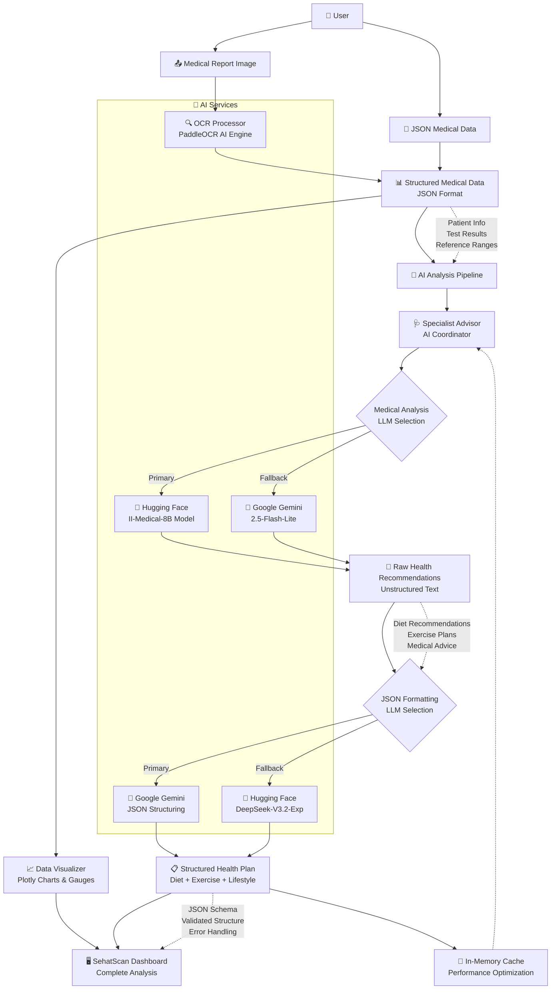

# SehatScan Workflow

```mermaid
  flowchart TD
      %% Input Layer
      User[👤 User] --> ImageUpload[📤 Medical Report Image]
      User --> JsonInput[📝 JSON Medical Data]
      
      %% OCR Processing with AI
      ImageUpload --> OCRProcessor[🔍 OCR Processor<br/>PaddleOCR AI Engine]
      OCRProcessor --> ExtractedData[📊 Structured Medical Data<br/>JSON Format]
      JsonInput --> ExtractedData
      
      %% Data Processing
      ExtractedData --> Visualizer[📈 Data Visualizer<br/>Plotly Charts & Gauges]
      ExtractedData --> AIAnalysis[🧠 AI Analysis Pipeline]
      
      %% Multi-LLM AI Processing Chain
      AIAnalysis --> SpecialistAdvisor[🩺 Specialist Advisor<br/>AI Coordinator]
      
      %% Primary AI Analysis
      SpecialistAdvisor --> MedicalAnalysis{Medical Analysis<br/>LLM Selection}
      MedicalAnalysis -->|Primary| HuggingFace[🤗 Hugging Face<br/>II-Medical-8B Model]
      MedicalAnalysis -->|Fallback| GeminiMedical[🔮 Google Gemini<br/>2.5-Flash-Lite]
      
      %% AI Output Processing
      HuggingFace --> RawHealthPlan[📝 Raw Health Recommendations<br/>Unstructured Text]
      GeminiMedical --> RawHealthPlan
      
      %% JSON Formatting with Second LLM
      RawHealthPlan --> JSONFormatting{JSON Formatting<br/>LLM Selection}
      JSONFormatting -->|Primary| GeminiFormat[🔮 Google Gemini<br/>JSON Structuring]
      JSONFormatting -->|Fallback| DeepSeekFormat[🤖 Hugging Face<br/>DeepSeek-V3.2-Exp]
      
      %% Structured Output
      GeminiFormat --> StructuredRecommendations[📋 Structured Health Plan<br/>Diet + Exercise + Lifestyle]
      DeepSeekFormat --> StructuredRecommendations
      
      %% Final Output
      Visualizer --> UserInterface[🖥️ SehatScan Dashboard<br/>Complete Analysis]
      StructuredRecommendations --> UserInterface
      
      %% Caching Layer
      StructuredRecommendations --> Cache[💾 In-Memory Cache<br/>Performance Optimization]
      Cache -.-> SpecialistAdvisor
      
      %% External AI Services
      subgraph "🤖 AI Services"
          HuggingFace
          GeminiMedical
          GeminiFormat
          DeepSeekFormat
          OCRProcessor
      end
      
      %% Data Flow Annotations
      ExtractedData -.->|Patient Info<br/>Test Results<br/>Reference Ranges| AIAnalysis
      RawHealthPlan -.->|Diet Recommendations<br/>Exercise Plans<br/>Medical Advice| JSONFormatting
      StructuredRecommendations -.->|JSON Schema<br/>Validated Structure<br/>Error Handling| UserInterface
      
      
      class User,ImageUpload,JsonInput input
      class OCRProcessor,HuggingFace,GeminiMedical,GeminiFormat,DeepSeekFormat,SpecialistAdvisor llm
      class ExtractedData,RawHealthPlan,AIAnalysis,JSONFormatting processing
      class Visualizer,StructuredRecommendations,UserInterface,Cache output

```
